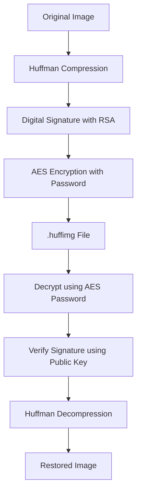

# 🗜️ Image Compression using Huffman Coding with Cybersecurity Features 🔐

This project provides a secure and efficient system for compressing images using **Huffman Coding** and securing them using **AES encryption** and **RSA digital signatures**. It includes a minimal web interface built with Flask and is ideal for educational and cybersecurity-related use cases.

---

## 🚀 Features

- ✅ **Lossless Image Compression** using Huffman Coding  
- 🔐 **AES Encryption** with password-based security  
- ✍️ **RSA Digital Signature** for verifying authenticity  
- 🌐 Minimal Web Interface (Flask + HTML)  
- 💾 Supports `.png`, `.jpg`, `.jpeg`, etc.  
- 🔁 Reversible flow: Compress → Encrypt → Decrypt → Decompress  

---

## 🛠️ Tech Stack

| Component          | Technology                    |
|--------------------|-------------------------------|
| Compression        | Huffman Coding (custom)        |
| Encryption         | AES using `cryptography` (Fernet) |
| Digital Signature  | RSA using `cryptography`       |
| Web Framework      | Flask (Python)                |
| Frontend           | HTML5, Bootstrap (minimal UI) |
| Keys               | OpenSSL-generated RSA Keys     |

---

## 📁 Folder Structure

```
DAA_LAB/
│
├── app.py                  # Flask application
├── templates/
│   └── index.html          # Web interface (HTML)
├── uploads/                # Temporary storage for files
├── keys/                   # RSA key files
│   ├── private_key.pem
│   └── public_key.pem
├── compression/            # Core logic for compression & security
│   ├── huffman.py          # Huffman compression & decompression
│   ├── encryption.py       # AES encryption & decryption
│   └── signature.py        # RSA signature & verification
├── .gitignore              # Ignore compiled files & temp folders
└── README.md               # Project documentation
```

---

## 💡 How It Works

### ✅ Compression + Encryption

1. Compress uploaded image using Huffman coding.  
2. Sign the compressed binary with your **RSA private key**.  
3. Encrypt the signed and compressed data with **AES** (using password).  
4. Save as `.huffimg`.

### ✅ Decryption + Decompression

1. Decrypt the `.huffimg` file using the correct password.  
2. Verify the digital signature using the **public key**.  
3. If verified, decompress the image using Huffman decoding.  
4. Return the original image file.

---

## 🔧 Installation & Setup

### 1. 📦 Install Dependencies

```bash
pip install flask cryptography
```

### 2. 🔐 Generate RSA Keys

Use OpenSSL or Python to generate keys:

```bash
# Run this in your terminal (one-time)
mkdir keys
openssl genrsa -out keys/private_key.pem 2048
openssl rsa -in keys/private_key.pem -pubout -out keys/public_key.pem
```

### 3. ▶️ Run the Flask App

```bash
python app.py
```

Then open your browser and go to:  
[http://localhost:5000](http://localhost:5000)

---

## 🖼️ Usage (via Web UI)

### 🔒 Compression + Encryption

1. Upload an image (PNG/JPG)  
2. Enter a password  
3. Click **Compress & Encrypt**  
4. Download the `.huffimg` file

### 🔓 Decryption + Decompression

1. Upload the `.huffimg` file  
2. Enter the correct password  
3. Click **Decrypt & Decompress**  
4. Download the restored image

---

## 📷 Screenshots (Optional)

You can add images like this once you upload them to your repo:

```

```

---

## 🔐 Security Flow


